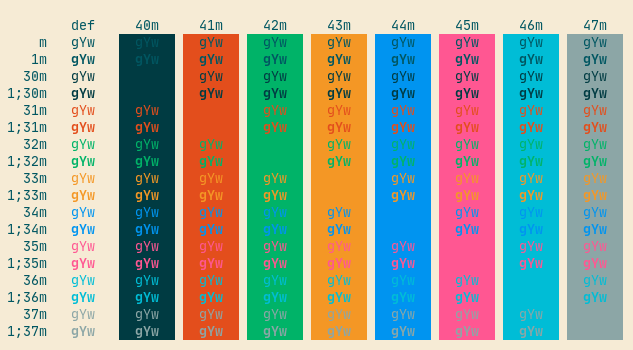

[license]: https://opensource.org/licenses/MIT
[license-badge]: https://img.shields.io/github/license/choestelus/kitty-noctis-lux?style=flat-square


# kitty-noctis-lux

[![License: MIT][license-badge]][license]

## Installation

1. Clone this repository or download noctis-lux.conf
    ```
    git clone https://github.com/choestelus/kitty-noctis-lux.git ~/.config/kitty/
    ```

2. (Optional) Create symlink into theme configuration
    ```
    ln -s ~/.config/kitty/kitty-noctis-lux/theme.conf ~/.config/kitty/theme.conf
    ```

3. Include theme configuration into your `kitty.conf` by add this line:
    ```
    include ./theme.conf
    ```

## Preview



## License

This repository is licensed with the MIT License.

original noctis theme by https://github.com/liviuschera/noctis
